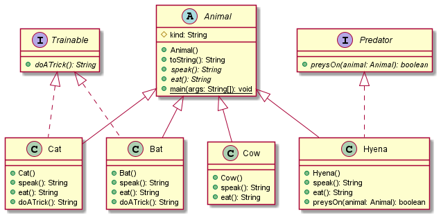
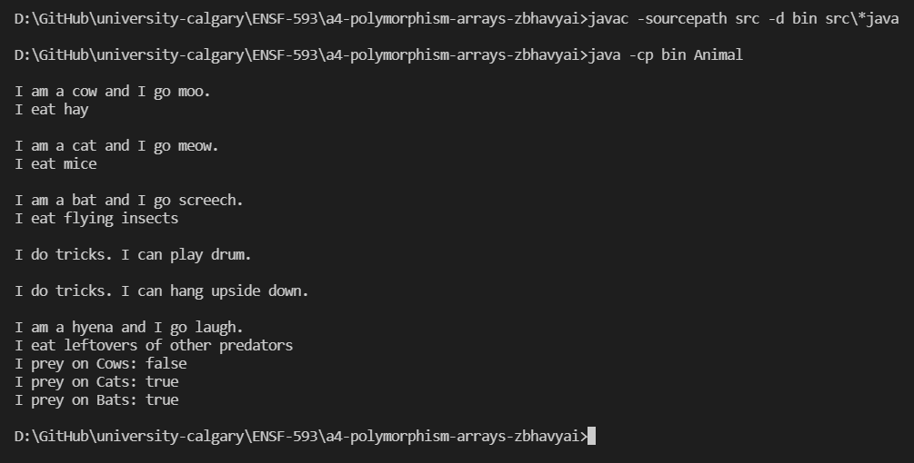

# Animals report

Author: Bhavyai Gupta


## UML class diagram




## Answers to Questions in step 6

#### Question 1

```java
Trainable pet1 = new Cow();
```

The above code is not valid, and would throw compilation error. This is because the class `Cow` does not implements `Trainable` interface, so `Cow` object can't be casted to an object of type `Trainable`.


#### Question 2

```java
Animal pet2 = new Cat();
System.out.println(pet2.doATrick());
```

The above code is not valid, and would throw compilation error while accessing the `doATrick()` method of `pet2` object. This is because the `Animal` class does not defines the method `doATrick()` to which the object of class `Cat` has been casted to.


#### Question 3

```java
Animal pet3 = new Cat();
System.out.println(((Trainable) pet3).doATrick());
```

The above code is valid, and runs successfully printing the tricks of the `Cat` using `doATrick()` method. Although the `pet3` variable is of type `Animal` which has no information of `doATrick()` method, the casting of `pet3` to `Trainable` allows `pet3` to access the method `doATrick()` of the class class `Cat` using runtime polymorphism.


## Execution and Testing


