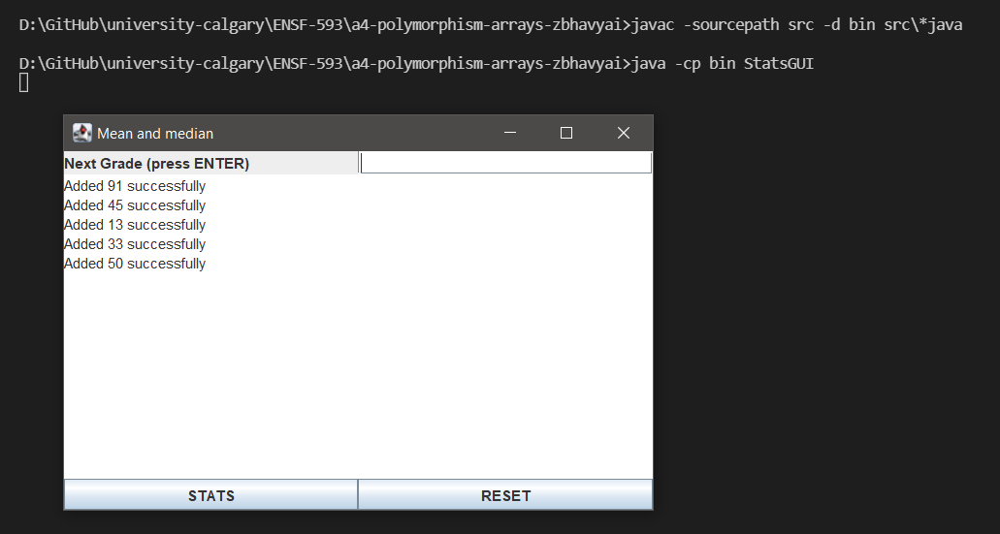
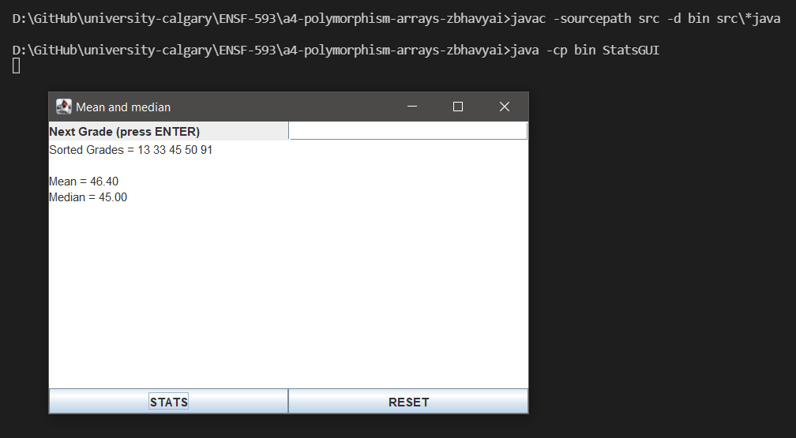
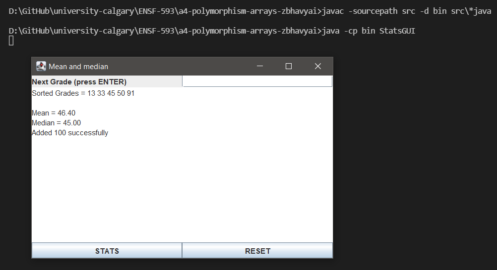
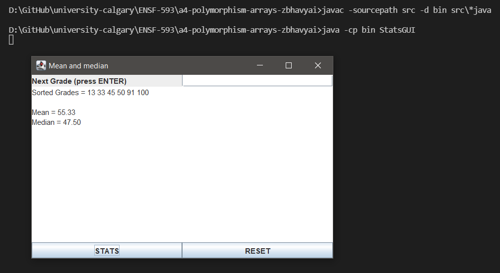
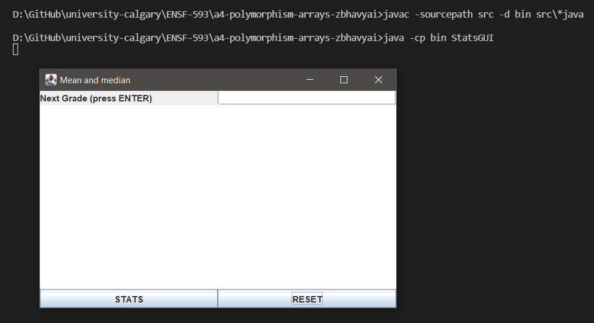

# Stats report
Author: Bhavyai Gupta

## UML class diagram

## Execution and Testing

Addition of grades by the user

Calculating the Stats by pressing the STATS button

Adding more grades on existing grades

Calculating the Stats on updated grades array, by again pressing the STATS button

Use of RESET button to reset the input and output

